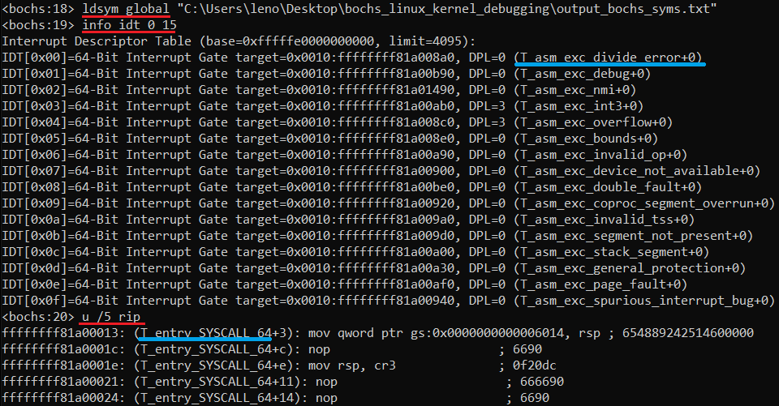
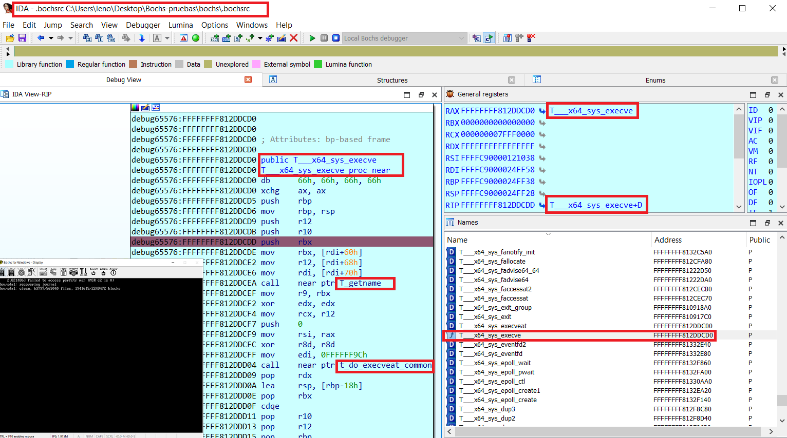
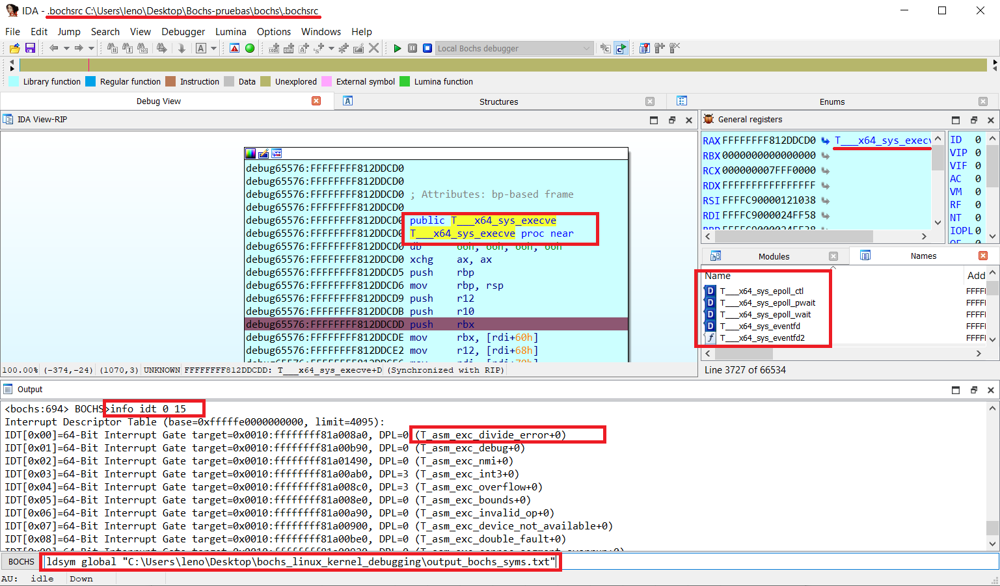

# bochs_linux_kernel_debugging
Tools for Linux kernel debugging on Bochs (including symbols, native Bochs debugger and IDA PRO)





# Generate symbol file for linux kernel debugging

Follow the below steps:

## 0- Generate a nm style debug info file

just use **nm** command on debug kernel image, example for Debian:

1- Install dbg image
```
root@debian# apt-get install linux-image-$(uname -r)-dbg
```

2- Check if nm works on dbg image:
```
dreg@debian# nm /usr/lib/debug/boot/vmlinux-$(uname -r) | tail
ffffffff8207d7c0 d zswap_same_filled_pages_enabled
ffffffff8262b54c b zswap_stored_pages
ffffffff8262b420 b zswap_trees
ffffffff81225df0 t zswap_update_total_size
ffffffff81226a50 t zswap_writeback_entry
ffffffff8262b538 b zswap_written_back_pages
ffffffff81c41fb8 r zswap_zpool_ops
ffffffff8207d7e0 d zswap_zpool_param_ops
```

3- Generate a valid output file for linsymtobch.py:
```
dreg@debian# nm /usr/lib/debug/boot/vmlinux-$(uname -r) > nm_output.txt
```

Also you can use/combine other kind of tools, Look this repo for more hints:

https://github.com/therealdreg/linux_kernel_debug_disassemble_ida_vmware

* **dump_kallsyms.sh**: dump symbols from /proc/kallsyms 
* **vmlinuxsystemap.sh**: copy current kernel vmlinuz & system.map to current directory
* **lkmsym/dumpsyms.sh**: load pattern-finder-ring0-LKM and dump kernel symbols

## 1- nm style output file to Bochs syms

Use linsymtobch.py to convert a nm style output file to a Bochs syms file:
```
python linsymbtobch.py symbol_file.txt output_bochs_syms.txt [letter 1] [letter 2] [letter 3] .... [--verbose]
```

Example:
```
./linsymtobch.py nm_output.txt output_bochs_syms.txt 
```

Output:
```
https://github.com/therealdreg/bochs_linux_kernel_debugging
-
MIT LICENSE Copyright <2020>
David Reguera Garcia aka Dreg - Dreg@fr33project.org
http://www.fr33project.org/ - https://github.com/therealdreg

usage: python linsymbtobch.py symbol_file.txt output_bochs_syms.txt [letter 1] [letter 2] [letter 3] .... [--verbose]

where letters can be empty for all symbols or a combination:

If lowercase, the symbol is local; if uppercase, the symbol is global (external).
------------------------------------
"A" The symbol's value is absolute, and will not be changed by further linking.

"B" "b" The symbol is in the uninitialized data section (known as BSS ).

"C" The symbol is common. Common symbols are uninitialized data. When linking, multiple common symbols may appear with the same name. If the symbol is defined anywhere, the common symbols are treated as undefined references.

"D" "d" The symbol is in the initialized data section.

"G" "g" The symbol is in an initialized data section for small objects. Some object file formats permit more efficient access to small data objects, such as a global int variable as opposed to a large global array.

"i" For PE format files this indicates that the symbol is in a section specific to the implementation of DLLs. For ELF format files this indicates that the symbol is an indirect function. This is a GNU extension to the standard set of ELF symbol types. It indicates a symbol which if referenced by a relocation does not evaluate to its address, but instead must be invoked at runtime. The runtime execution will then return the value to be used in the relocation.

"N" The symbol is a debugging symbol.

"p" The symbols is in a stack unwind section.

"R" "r" The symbol is in a read only data section.

"S" "s" The symbol is in an uninitialized data section for small objects.

"T" "t" The symbol is in the text (code) section.

"U" The symbol is undefined.

"u" The symbol is a unique global symbol. This is a GNU extension to the standard set of ELF symbol bindings. For such a symbol the dynamic linker will make sure that in the entire process there is just one symbol with this name and type in use.

"V" "v" The symbol is a weak object. When a weak defined symbol is linked with a normal defined symbol, the normal defined symbol is used with no error. When a weak undefined symbol is linked and the symbol is not defined, the value of the weak symbol becomes zero with no error. On some systems, uppercase indicates that a default value has been specified.

"W" "w" The symbol is a weak symbol that has not been specifically tagged as a weak object symbol. When a weak defined symbol is linked with a normal defined symbol, the normal defined symbol is used with no error. When a weak undefined symbol is linked and the symbol is not defined, the value of the symbol is determined in a system-specific manner without error. On some systems, uppercase indicates that a default value has been specified.

"-" The symbol is a stabs symbol in an a.out object file. In this case, the next values printed are the stabs other field, the stabs desc field, and the stab type. Stabs symbols are used to hold debugging information.

"?" The symbol type is unknown, or object file format specific.
------------------------------------

0xffffffff81412a30 T_aa_af_perm
0xffffffff813ff4f0 T_aa_alloc_profile
0xffffffff8140c420 T_aa_alloc_proxy
0xffffffff82c71f0d T_aa_alloc_root_ns
0xffffffff81409e20 T_aa_alloc_secid
0xffffffff813f7bc0 T_aa_apply_modes_to_perms
0xffffffff813f6030 T_aa_audit
0xffffffff8140a210 T_aa_audit_file
0xffffffff813f6010 T_aa_audit_msg

...

done!

        total symbols written: 115131
        total letters written: A B D R T V W a b d r t
          total letters found: A B D R T V W a b d r t
```

Example filtering some symbols:
```
./linsymtobch.py nm_output.txt output_bochs_syms.txt T V d 
```

## 2- Load syms file on Bochs debugger

Load generated file on Bochs debugger with "ldsym global", example:
```
ldsym global "C:\Users\leno\Desktop\bochs_linux_kernel_debugging\output_bochs_syms.txt"
```

Done! try: "info idt" "u /10" ...


## How to use Bochs symbol file on IDA PRO

Edit "C:\Program Files\IDA Pro 7.7\cfg\dbg_bochs.cfg"

```
BOCHSDBG = "C:\\Users\\leno\\Desktop\\Bochs-pruebas\\bochs\\bochs.exe";
BOCHSRC = "C:\\Users\\leno\\Desktop\\Bochs-pruebas\\bochs\\.bochsrc";
```

Go to IDA .....

Debugger -> Run -> Local Bochs Debugger 

Application:

```
C:\Users\leno\Desktop\Bochs-pruebas\bochs\.bochsrc
```

Cick Debug Options -> Set specific options -> Select Disk image 

Download this repo:

https://github.com/therealdreg/symseghelper

in Host: Open IDA PRO, start a Bochs debug session and go to File -> Script File

Select ida_load_names.py, this script ask you for generated Bochs symbol file

Done!

After that you can load symbols on Native Bochs Debugger (running inside IDA PRO) using "ldsym global"

So, IDA PRO with Bochs symbols (ida_load_names.py) + Bochs native debugger with symbols (ldsym global), The best of both worlds:



# Related 

Helper scripts for windows debugging with symbols for Bochs and IDA Pro (PDB files). Very handy for user mode <--> kernel mode:
- https://github.com/therealdreg/symseghelper

Helper script for Linux kernel debugging with IDA Pro on VMware + GDB stub (including some symbols helpers):
- https://github.com/therealdreg/linux_kernel_debug_disassemble_ida_vmware

Dump PDB Symbols including support for Bochs Debugging Format (with wine support):
- https://github.com/therealdreg/pdbdump_bochs

Helper script for Windows kernel debugging with IDA Pro on native Bochs debugger:
- https://github.com/therealdreg/ida_bochs_windows
